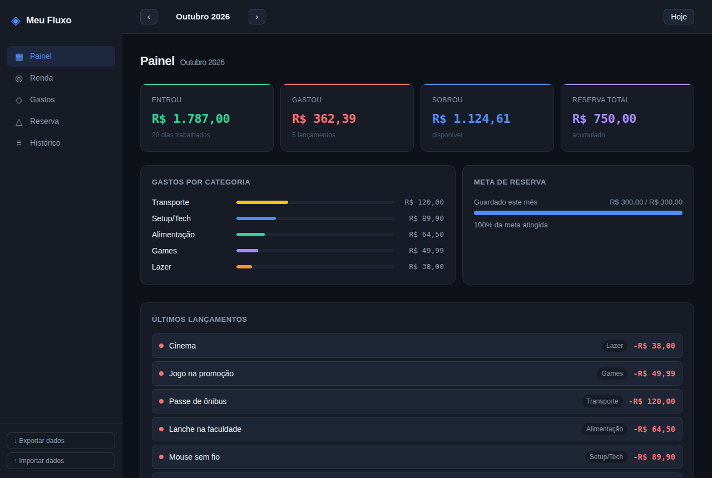

# ◈ Meu Fluxo

Aplicação web de **controle financeiro pessoal**, feita para acompanhar mês a mês quanto entrou, quanto foi gasto e quanto sobrou, com uma meta de reserva.

Projeto pessoal, criado para organizar a renda do estágio e praticar JavaScript puro, manipulação do DOM e armazenamento local.

**🔗 [Ver online](https://aangelkjpn.github.io/Fluxo_Controle_Financeiro/)** · teste direto no navegador, os dados ficam salvos só no seu computador.

<p align="center">
  
</p>

<p align="center"><sub>Dados fictícios, usados só para demonstração.</sub></p>

---

## Funcionalidades

- **Painel:** resumo do mês com entradas, gastos, saldo e reserva acumulada
- **Renda:** calculadora da bolsa proporcional aos dias trabalhados, com vale-refeição e vale-transporte, e registro de entradas extras
- **Gastos:** lançamentos por categoria (Setup/Tech, Games, Alimentação, Transporte, Roupas, Lazer e Outros)
- **Gastos por categoria:** barras mostrando para onde o dinheiro foi
- **Reserva:** meta mensal de quanto guardar e acompanhamento do progresso
- **Histórico:** resumo de cada mês com entradas, gastos, reserva e saldo
- **Navegação por mês** para consultar meses anteriores
- **Exportar e importar dados** em JSON, para fazer backup ou trocar de computador

---

## Tecnologias


- **HTML, CSS e JavaScript** puros, sem framework de JavaScript
- **Bootstrap 5** (via CDN) para o grid responsivo, formulários, barras de progresso, notificações (toast) e o menu lateral no celular
- **localStorage** para salvar os dados no navegador

---

## Como usar

1. Baixe ou clone o repositório:
   ```bash
   git clone https://github.com/aangelkjpn/Fluxo_Controle_Financeiro.git
   ```
2. Abra o arquivo `index.html` no navegador.

Não precisa instalar nada nem rodar servidor (só de internet para carregar o Bootstrap e as fontes).

---

## Estrutura

```
├── index.html   # Estrutura das abas (Painel, Renda, Gastos, Reserva, Histórico)
├── style.css    # Estilos (tema escuro)
└── app.js       # Lógica, cálculos e armazenamento
```

---

## Observações

- Os dados ficam salvos **apenas no seu navegador**, nada é enviado para a internet.
- Use **Exportar dados** de vez em quando para ter um backup.

---

Desenvolvido por [Angelo Gabriel](https://github.com/aangelkjpn)
